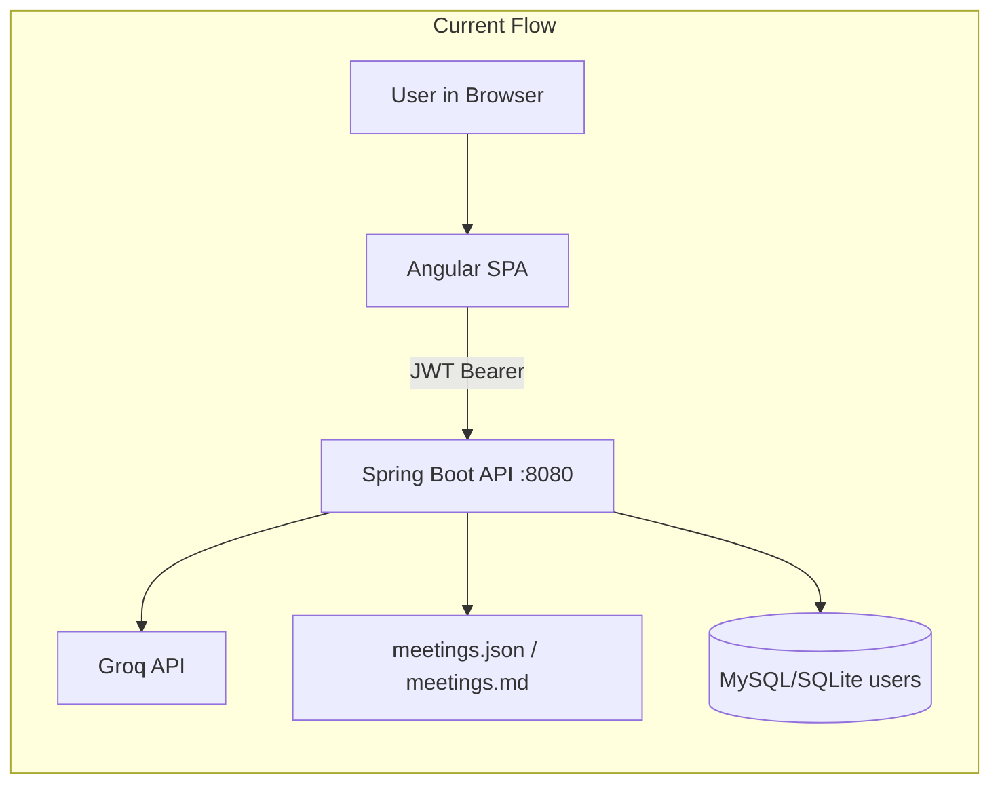
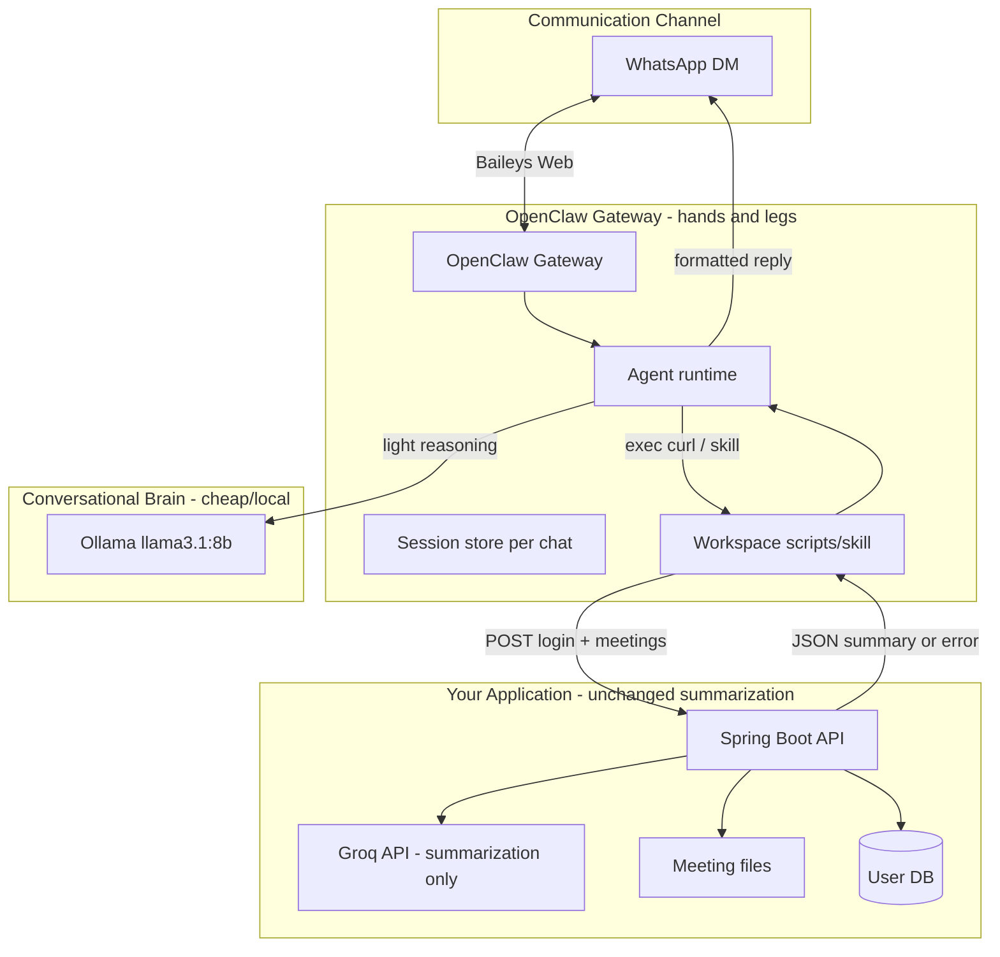

# OpenClaw Integration Plan

## What you have today

Your app is a **Spring Boot REST API + Angular SPA** for AI meeting summaries:



**Key backend facts** (from `backend/src/main/java/com/ai/meetingnotes/service/MeetingService.java`):

- `POST /api/auth/login` → returns JWT + user (`planTier`, `subscriptionStatus`)
- `POST /api/meetings` with `{ title?, transcript }` → Groq summarization → saves meeting → returns structured summary
- Pro check today: `planTier=PRO` **and** `subscriptionStatus=ACTIVE` → unlimited summaries; free users get 3 lifetime summaries or credits
- Errors: `403` + `{ error, limitReached: true }` for quota; `502` for Groq failure

**WhatsApp agent requirement (new):** Pro-only channel — free users must be rejected **before** transcript collection, even if they still have free summary quota on the web UI.

---

## Target architecture: OpenClaw as hands/legs, Ollama as brain, Groq for heavy lifting



| Layer | Role | LLM / runtime |
|-------|------|---------------|
| **WhatsApp** | User-facing chat channel | — |
| **OpenClaw Gateway** | Receives/sends messages, session state, tool execution | — |
| **Ollama `llama3.1:8b`** | Decides *what to ask next*, parses user replies, formats output for WhatsApp | Local, no per-turn Groq cost |
| **Spring Boot API** | Auth, Pro check, quota, persistence | — |
| **Groq** (backend) | Heavy transcript → structured summary JSON | Same as web UI today |

OpenClaw is **not** the summarizer. It orchestrates a conversation and calls your API exactly like the Angular dashboard does.

---

## What this document contains

Self-contained playbook for integrating OpenClaw with this app. Copy the agent-behavior sections into your OpenClaw workspace as `AGENTS.md` (OpenClaw's standard operating-instructions file).

### Section 1 — Application primer
- Stack summary (Spring Boot 21, Angular, JWT, Groq, Stripe Pro)
- Endpoints the agent must call (login, billing status, create meeting)
- Request/response shapes from `AuthResponse`, `MeetingRequest`, `MeetingResponse`
- How the web UI flow maps 1:1 to WhatsApp steps

### Section 2 — OpenClaw setup (hands/legs)
- Install OpenClaw gateway on a host that can reach your API (local dev or Oracle VM)
- WhatsApp pairing: `openclaw channels login --channel whatsapp` then `openclaw gateway`
- Minimal `~/.openclaw/openclaw.json` snippet (current 2026 schema; local-only, **no VM**):

```json5
{
  agents: {
    defaults: {
      workspace: "C:/Users/rzambre/Desktop/ai-meeting-notes/openclaw-workspace",
      model: { primary: "ollama/llama3.1:8b" },
    },
  },
  // Local Ollama provider — native URL only (never /v1, tool-calling breaks on /v1)
  models: {
    providers: {
      ollama: {
        baseUrl: "http://127.0.0.1:11434",
        apiKey: "ollama-local",
        api: "ollama",
        timeoutSeconds: 300,   // first turn of a cold llama3.1:8b can be slow
        models: [
          { id: "llama3.1:8b", name: "llama3.1:8b", params: { keep_alive: "15m" } },
        ],
      },
    },
  },
  channels: {
    whatsapp: {
      dmPolicy: "pairing",        // or allowlist for known numbers
      allowFrom: ["+91XXXXXXXXXX"], // ← friend's number used for testing
    },
  },
}
```

- Ollama config: `ollama pull llama3.1:8b` (already pulled locally), native URL `http://127.0.0.1:11434` (not `/v1`)
- After config, run `openclaw models set ollama/llama3.1:8b` and verify with `openclaw models list --provider ollama`
- **Twilio note:** OpenClaw has **no** Twilio-WhatsApp channel — WhatsApp is Baileys (WhatsApp Web) via QR pairing, which works with any number, including a personal one. Twilio is only supported for SMS/MMS (different channel, needs public HTTPS webhook).
- Optional Groq plugin for OpenClaw brain if Ollama is unavailable — documented as fallback only

### Section 3 — Conversation state machine (agent behavior)

Multi-step flow stored in OpenClaw session memory (not backend DB):

| Step | Agent asks | Validates | On success |
|------|-----------|-----------|------------|
| `GREET` | Welcome + explain Pro-only WhatsApp feature | — | → `ASK_EMAIL` |
| `ASK_EMAIL` | Email address | email format | → `ASK_PASSWORD` |
| `ASK_PASSWORD` | Password (use OpenClaw secrets/ask_user if available) | — | → `LOGIN` |
| `LOGIN` | — | `POST /api/auth/login` | → `CHECK_PRO` |
| `CHECK_PRO` | — | `planTier=PRO && subscriptionStatus=ACTIVE` | Pro → `ASK_TITLE`; else → `REJECT_FREE` |
| `ASK_TITLE` | Meeting title (optional, send "skip" for untitled) | — | → `ASK_TRANSCRIPT` |
| `ASK_TRANSCRIPT` | Paste transcript (≥20 chars; allow multi-message append until user sends "done") | min length | → `SUBMIT` |
| `SUBMIT` | "Generating summary…" | `POST /api/meetings` with stored JWT | → `REPLY_SUCCESS` or `REPLY_ERROR` |
| `REPLY_*` | Format summary for WhatsApp (chunk if >4000 chars) | — | → `GREET` (ready for next meeting) |

**Pro gate (two layers):** *(both layers now implemented — see `MeetingService.requireProForAgentChannel` and `MeetingController`)*
1. **Agent layer:** After login, reject non-Pro with upgrade link (`{FRONTEND_URL}/dashboard/billing`) — see `openclaw-workspace/AGENTS.md` rule 4
2. **Backend layer:** `POST /api/meetings` returns `403` for `X-Agent-Channel: whatsapp` requests when the JWT user is not `planTier=PRO && subscriptionStatus=ACTIVE` — prevents bypass if someone scripts the API directly

### Section 4 — API integration scripts (how agent "uses the app like a human")

OpenClaw agent uses **`exec`** to run workspace shell scripts (same pattern as a human clicking "Generate Summary"). Both **PowerShell** (`.ps1`, for the Windows dev machine) and **bash** (`.sh`, for a future Linux host) variants ship in `openclaw-workspace/scripts/`; they read `API_BASE`/`FRONTEND_URL` from `.env` and build JSON safely (PowerShell `ConvertTo-Json` / bash via `node`).

**`openclaw-workspace/scripts/agent-login.sh`**
```bash
curl -s -X POST "$API_BASE/api/auth/login" \
  -H "Content-Type: application/json" \
  -d "{\"email\":\"$EMAIL\",\"password\":\"$PASSWORD\"}"
```

**`openclaw-workspace/scripts/agent-create-meeting.sh`**
```bash
curl -s -X POST "$API_BASE/api/meetings" \
  -H "Authorization: Bearer $JWT" \
  -H "Content-Type: application/json" \
  -H "X-Agent-Channel: whatsapp" \
  -d "{\"title\":\"$TITLE\",\"transcript\":\"$TRANSCRIPT\"}"
```

Environment in workspace `.env`:
- `API_BASE=http://localhost:8080` (local dev) or `http://<host>:8080` (deployed host)
- JWT held in session variables between steps (never logged to WhatsApp)

**Response handling rules for the agent:**
- `201` → parse `summary`, `actionItems`, `keyPoints`, etc.; format concise WhatsApp reply
- `403` + `limitReached` → "Upgrade to Pro at …" (should not happen for Pro users on WhatsApp if gate works)
- `401` → "Login expired, let's sign in again"
- `502` → "Summary generation failed, try again later"
- `400` validation → re-prompt for transcript

### Section 5 — WhatsApp message formatting
- Chunk long summaries at ~3500 chars (WhatsApp limit ~4096)
- Template: title, summary paragraph, top action items, link hint to web dashboard for full detail
- Transcript collection: accept multiple messages until user sends `DONE` or `/submit`

### Section 6 — Security and ops notes
- Passwords: never echo back in WhatsApp; clear from session after login
- JWT TTL: 24h (`jwt.expiration` in application-dev.properties); re-login when expired
- WhatsApp `dmPolicy: pairing` for unknown senders
- CORS does not apply to server-side curl from OpenClaw
- Backend secrets stay in Spring Boot; OpenClaw only needs API URL + Ollama local

### Section 7 — Backend changes (status: reflected in code)
DONE — the WhatsApp Pro gate is enforced server-side:

1. `MeetingController.createMeeting` now reads the optional `X-Agent-Channel` header and calls
   `MeetingService.requireProForAgentChannel(user, agentChannel)` **before** any summarization
   work. Non-Pro users on the WhatsApp channel get `403` + `{ error, limitReached: true }`,
   even if they still have free web-UI quota.

Optional follow-ups (not needed for the first version):
1. `User.whatsappPhone` column for phone→account linking (skip if login-each-time is fine)
2. Rate limit the WhatsApp channel separately

---

## File layout (implemented)

```
ai-meeting-notes/
├── OpenClaw.md                     ← this plan (updated to reflect what is implemented)
└── openclaw-workspace/             ← agent workspace for OpenClaw
    ├── AGENTS.md                   ← agent behavior instructions (state machine, Pro gate, formatting)
    ├── README.md                   ← human quickstart for the workspace
    ├── .env.example                ← API_BASE / FRONTEND_URL template (committed)
    ├── .env                        ← git-ignored runtime values
    └── scripts/
        ├── agent-login.{ps1,sh}                ← POST /api/auth/login
        └── agent-create-meeting.{ps1,sh}       ← POST /api/meetings (+ X-Agent-Channel: whatsapp)
```

Backend changes (same commit): `MeetingController` reads the `X-Agent-Channel`
header; `MeetingService.requireProForAgentChannel()` enforces the Pro-only gate.

---

## Dev verification checklist

1. Start MySQL + Spring Boot (`mvn spring-boot:run -Dspring-boot.run.profiles=dev`)
2. Start Ollama: `ollama serve` + `ollama pull llama3.1:8b` (already pulled)
3. Configure OpenClaw (see Section 2 snippet) → `openclaw models set ollama/llama3.1:8b` → pair WhatsApp (`openclaw channels login --channel whatsapp`) → `openclaw gateway`
4. Message the bot from a **Pro** test account (`test78@gmail.com` per README)
5. Complete login → title → transcript → receive summary
6. Repeat with a **Free** account → must get Pro upgrade message, no summary call
7. Optional API-level gate test (bypasses the agent): login as a FREE user via curl,
   then `POST /api/meetings` with `X-Agent-Channel: whatsapp` + valid JWT → expect `403`

---

## LLM cost model (why Ollama for OpenClaw)

| Turn type | Model | Cost |
|-----------|-------|------|
| "What's your email?" / parsing title | Ollama llama3.1:8b | Free (local) |
| Transcript → structured summary | Groq (backend) | 1 API call per meeting (same as web) |

This avoids burning Groq tokens on every WhatsApp back-and-forth while keeping summary quality identical to the dashboard.
